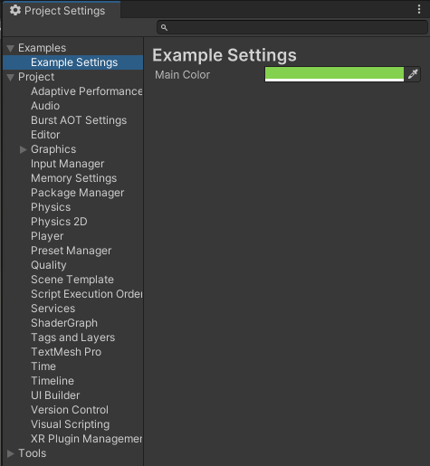

# Easy Editor Settings

Create easy settings for your Editor Tools without any Boilerplate thanks to Source Generators.  

## How it works

Add the `[EasyEditorSettings]` Attribute to a `ScriptableSingleton<T>` class and the Settings will appear in the Preferences or ProjectSettings Window.

``````c#
using UnityEngine;
using UnityEditor;
using elhodel.EasyEditorSettings;

[EasyEditorSettings("ProjectSettings/Tools/ExampleSettings.asset", "Examples/Example Settings", FilePathAttribute.Location.ProjectFolder)]
public partial class ExampleSettings : ScriptableSingleton<ExampleSettings>
{
    [SerializeField]
    private Color _mainColor;

}
``````




Usage:

``````c#
using UnityEditor;
using UnityEngine.UIElements;

public class ExampleEditorWindow : EditorWindow
{
    [MenuItem("Tools/Example Window")]
    public static void GenerateWindow() => EditorWindow.GetWindow<ExampleEditorWindow>();
    private void CreateGUI()
    {
        rootVisualElement.style.backgroundColor = ExampleSettings.instance.MainColor;
    }

}
``````

For all private fields with the Attribute `[SerializeField]` Properties to access and setting the value are auto generated. The Property is needed to properly save eventual changes to disc.

## Attribute Arguments

`savePath`:  
Where the Settings should be saved on the Machine.
When `location` is set to `FilePathAttribute.Location.ProjectFolder` the Path is relative to the ProjectFolder. 
When `location` is set to `FilePathAttribute.Location.PreferencesFolder` the Path is relative to the Preferences Folder: https://docs.unity3d.com/ScriptReference/FilePathAttribute.Location.PreferencesFolder.html

`menuPath`:
Path in the EditorWindow of the ProjectSettings or Prefernces depending on `location`

`location`:
Where the Settings should be stored:
- In the Project Folder for Project specific Settings 
- In the Preferences Folder for Project overarching Settings

## Planned Improvements

- Improve saving timing, currently the whole Setting is always saved on any change which is suboptimal when working with complex/big Settings.
- Expose Event when Settings changed.
- Add simpler Attribute that does not require 
